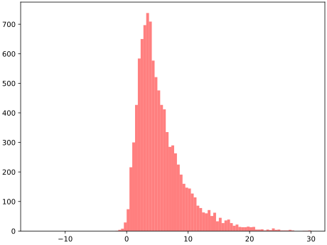

# PySATL_NMVM_Module


Python package for statistical analysis of Normal Mean or/and Variance Mixtures.

# Installation
Requirements:
```
pip install requirements.txt
```
For contributing:
```
pip install requirements.dev.txt
```

# Requirements
* `numpy~=1.26.4`
* `scipy~=1.13.1`
* `matplotlib~=3.8.4`
* `numba~=0.59.0`
* `mpmath~=1.3.0`

Development:
* `mypy~=1.10.0`
* `black~=24.4.2`
* `isort~=5.13.2`
* `mpmath~=1.3.0`
* `pytest~=7.4.4`


# Theoretical basis

### Normal Mean Mixture
$Y_{NMM}$ is called Normal Mean Mixture (NMM) if it can be represented in classical form with parameters $\alpha$, $\beta$, $\gamma$ $\in \mathbf{R}$ and mixing density function $g(x)$ as:\
\
$Y_{NMM} = \alpha + \beta \cdot \xi + \gamma \cdot N$, where $N \sim \mathcal{N}(0, 1), \xi \sim g(x)$ and $\xi \perp N$

### Normal Variance Mixture
$Y_{NVM}$ is called Normal Variance Mixture (NVM) if it can be represented in classical form with parameters $\alpha$, $\beta$, $\gamma$ $\in \mathbf{R}$ and mixing density function $g(x)$ as:\
\
$Y_{NVM} = \alpha + \gamma \cdot \sqrt{\xi} \cdot N$, where $N \sim \mathcal{N}(0, 1), \xi \sim g(x)$ and $\xi \perp N$

### Normal Mean-Variance Mixture 
$Y_{NMVM}$ is called Normal Mean-Variance Mixture (NMVM) if it can be represented in classical form with parameters $\alpha$, $\beta$, $\gamma$ $\in \mathbf{R}$ and mixing density function $g(x)$ as:\
\
$Y_{NMVM}$ = $\alpha  + \beta \cdot \xi +  \gamma \cdot \sqrt{\xi} \cdot N$, where $N \sim \mathcal{N}(0, 1), \xi \sim g(x)$ and $\xi \perp N$

Problem with classical representation is that it is not unique. So usually it is more convenient to make some substitutions and get canonical representation of mixture.

## Canonical representations
$Y_{NMM}(\xi, \sigma) = \xi + \sigma \cdot N$ \
$Y_{NVM}(\xi, \alpha) = \alpha + \sqrt{\xi} \cdot N$ \
$Y_{NMVM}(\xi, \alpha, \mu) = \alpha + \mu \cdot \xi + \sqrt{\xi} \cdot N$\
where $\alpha, \mu, \sigma \in \mathbf{R}$; $N \sim \mathcal{N}(0, 1); \xi \sim g(x)$

Normal Mean or/and Variance Mixtures have useful applications in statistical analysis and financial math.

# Mixture sample generation:
Classes are implemented in directory [**src.mixtures**](https://github.com/Engelsgeduld/PySATL_NMVM_Module/tree/main/src/mixtures) .

There are three classes of mixtures:
* [NormalMeanMixtures](https://github.com/Engelsgeduld/PySATL_NMVM_Module/blob/main/src/mixtures/nm_mixture.py)
* [NormalVarianceMixtures](https://github.com/Engelsgeduld/PySATL_NMVM_Module/blob/main/src/mixtures/nv_mixture.py)
* [NormalMeanVarianceMixtures](https://github.com/Engelsgeduld/PySATL_NMVM_Module/blob/main/src/mixtures/nmv_mixture.py)

One can select mixture representation (classical or canonical) by specifying *mixture_form* parameter.
## Usage
Example of mixture object creation:
```Python
from src.mixtures.nm_mixture import *
from scipy.stats import norm

mixture = NormalMeanVarianceMixtures("classical", alpha=1.2, beta=2.2, gamma=1, distribution=norm)
```


Example of mixture sample generation:
```Python
from src.generators.nm_generator import NMGenerator
from src.mixtures.nm_mixture import *
from scipy.stats import expon

generator = NMGenerator()
mixture = NormalMeanMixtures("classical", alpha=1.6, beta=4, gamma=1, distribution=expon)
sample = generator.classical_generate(mixture, 5000)
```

Histogram of *sample* values:\


# Calculation of standard statistical characteristics of mixture:
* Calculation of pobability density function\
`compute_pdf()`
* Calculation of logarithm of pobability density function\
`compute_logpdf()`
* Cumulative distribution function\
`compute_cdf()`
* Moments calculation\
`compute_moment()`

# Support algorithms
## Randomized Quasi-Monte Carlo method (RQMC)
Computes given integral with the limits of integration being 0 and 1 using Randomized Quasi-Monte Carlo method.

### Parameters:
`func`: integrated function\
`error_tolerance`: pre-specified error tolerance\
`count`: number of rows of random values matrix\
`base_n`: number of columns of random values matrix\
`i_max`: allowed number of cycles\
`a`: parameter for quantile of normal distribution

### Usage:
```Python
from src.algorithms.support_algorithms.rqmc import RQMC
rqmc = RQMC(lambda x: x**3 - x**2 + 1, error_tolerance=1e-5)
```
So `rqmc()[0]` is estimated integral value and `rqmc()[1]` is current error tolerance.

# Parameter estimation algorithms for Normal Mean or/and Variance Mixtures:
* ## Semiparametric estimation of parameter $\mu$ in Normal Mean-Variance mixture.
    Parameter $\mu$ estimation for $Y_{NMVM}(\xi, \alpha, \mu) = \alpha + \mu \cdot \xi + \sqrt{\xi} \cdot N$\
    where $\alpha = 0; N \sim \mathcal{N}(0, 1); \xi \sim g(x)$

    Algorithm was created by Belomestny & Panov(2017)

    ### Parameters
    `m` - Search area radius\
    `tolerance` - Defines error tolerance to stop bisection algorithm\
    `max_iterations` - Maximum allowed iterations for bisection algorithm\
    `omega` - Lipschitz continuous odd function on $\mathbf{R}$ with compact support\

    Algorithm returns estimated $\mu$ value and estimation successfulness.

    ### Usage
    ```Python
    from scipy.stats import halfnorm
    from src.estimators.semiparametric.nmv_semiparametric_estimator import NMVSemiParametricEstimator
    from src.generators.nmv_generator import NMVGenerator
    from src.mixtures.nmv_mixture import NormalMeanVarianceMixtures

    # Generate sample of NMV-mixture with parameter mu = 2 to test the algorithm
    mixture = NormalMeanVarianceMixtures("canonical", alpha=0, mu=2, distribution=halfnorm)
    sample = NMVGenerator().canonical_generate(mixture, 1000)

    # Create new estimator for NMV-mixture and select an algorithm by its name
    estimator = NMVSemiParametricEstimator("mu_estimation", {"m": 10, "tolerance": 10 ** -5})
    estimate_result = estimator.estimate(sample)
    print("Estimated mu value: ", estimate_result.value, "\nEstimation is successful: ", estimate_result.success)
    ```
    Output:
    ```
    Estimated mu value:  2.0798295736312866 
    Estimation is successful:  True
    ```
* ## Estimation of mixing density for given $\mu$ in Normal Mean-Variance mixture.
    Mixing density function $g(x)$ estimation for $Y_{NMVM}(\xi, \alpha, \mu) = \alpha + \mu \cdot \xi + \sqrt{\xi} \cdot N$\
    where $\alpha = 0, \mu \in \mathbf{R}; N \sim \mathcal{N}(0, 1); \xi \sim g(x)$

    Algorithm was created by Belomestny & Panov(2017)

    ### Parameters
    `mu` - Parameter $\mu$ of NMV-mixture\
    `gmm` - Parameter $\gamma$ for Belomestny & Panov(2017) algorithm\
    `u_value` - Parameter $U_n$ for Belomestny & Panov(2017) algorithm\
    `v_value` - Parameter $V_n$ for Belomestny & Panov(2017) algorithm\
    `x_data` - Points to estimate function $g(x)$

    Algorithm returns list of estimated g(x) values and estimation successfulness.

    ### Usage:
    For demonstration purposes to use the algorithm we can generate sample from NMV mixture with parameter $\mu = 1$, size 25 values and mixing density function $g(x) = exp(-x)$
    ```Python
    from scipy.stats import expon
    from src.generators.nmv_generator import NMVGenerator
    from src.mixtures.nmv_mixture import NormalMeanVarianceMixtures

    real_g = expon.pdf # Real g(x)

    mixture = NormalMeanVarianceMixtures("canonical", alpha=0, mu=1, distribution=expon)
    sample = NMVGenerator().canonical_generate(mixture, 25)
    ```
    Now we assume that we know nothing about $g(x)$, and try to estimate it in points 0.5, 1 and 2.
    ```Python
    from src.estimators.semiparametric.nmv_semiparametric_estimator import NMVSemiParametricEstimator

    x_data = [0.5, 1, 2] # x points, where to estimate g(x)
    estimator = NMVSemiParametricEstimator(
        "g_estimation_given_mu", {"x_data": x_data, "u_value": 7.6, "v_value": 0.9}
    )
    est = estimator.estimate(sample) # est is EstimateResult object
    ```
    Result of the estimation can be accesses by `est.list_value`
    ```
    x = 0.5, Real g(x) value:  0.6065 Estimated:  0.9727
    x = 1,   Real g(x) value:  0.3678 Estimated:  0.5227
    x = 2,   Real g(x) value:  0.1353 Estimated:  0.1866
    ```


# Reference list
* Hintz, E., Hofert, M., & Lemieux, C. (2019). Normal variance mixtures: Distribution, density and parameter estimation. Comput. Stat. Data Anal., 157, 107175.
* Belomestny, D., & Panov, V. (2017). Semiparametric estimation in the normal variance-mean mixture model. Statistics, 52, 571 - 589.


# Contributors:
* Andreev Sergey - [andreev-sergej](https://github.com/andreev-sergej)
* Knyazev Dmitrii - [Engelsgeduld](https://github.com/Engelsgeduld)
